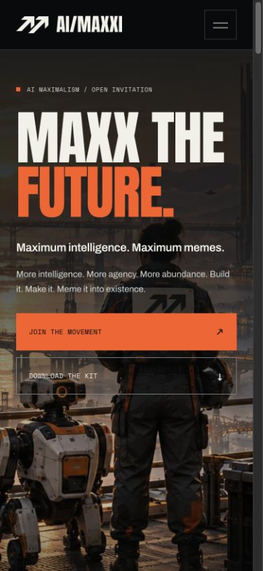

# AI/MAXXI brand v1 review

This release rebuilds the movement's public entrance with a refined paired-arrow identity, original human-and-machine artwork, the approved doctrine and a usable transmission kit. Production promotion follows review.

## Included

- Static HTML, separate CSS and progressive JavaScript, self-hosted typography.
- Original hero with desktop/mobile crops and three campaign posters.
- Outlined SVG/transparent PNG identity in three colors; avatars, favicon and app icons.
- Two editable SVG meme templates, PNG exports, font licenses, provenance and community guidance.
- Complete downloadable kit plus individual preview/download links.
- Public, prefilled GitHub submission and editable X sharing links.
- Exact mixed-case Solana mint, generated token destinations and honest clipboard feedback.

## Verification

- `npm run build` and `npm test`: 14 passing regression tests.
- Browser layout checked at 390, 768 and 1440 CSS pixels without document overflow.
- Mobile keyboard navigation: initial close-button focus, Tab navigation, Escape focus restoration, and anchor destination focus.
- Native clipboard success checked; delayed success, denial and unavailable API are regression tested with the production script in a VM.
- Script-free HTML fixture checked at 390px: readable content, visible static navigation, working ordinary links and hidden inactive controls.
- Reduced-motion CSS disables smooth scrolling, transitions, animation and poster zoom; essential content is never animation-gated.
- Supporting steel text contrast is 6.56:1 on graphite and 6.08:1 on the secondary panel; orange/graphite is 6.36:1.
- All local links, legacy anchors, font/image references, advertised export dimensions and kit archive contents checked.
- X opens the intended editable text and URL. GitHub preserves the prefilled issue through its sign-in redirect. No post or issue submitted.
- Jupiter’s current query-based swap link was verified to select `ai/maxxi` by its exact mint. The legacy `/swap/SOL-mint` route falls back to USDC and is not used.
- Solscan and Dexscreener URLs preserve the mint; their destination pages presented anti-bot verification in this browser, so their rendered token views could not be checked.
- No page JavaScript errors observed.

The authenticated GitHub issue editor itself was not submitted or exercised past sign-in. Token destinations are external services; the site never connects a wallet or executes a transaction.

## Release

The branch uses the existing Vercel Git Preview workflow. The legacy manual deployment helper is excluded. Existing community-tool PRs remain separate. The local strategy and research files are preserved and excluded from publication.

Record the current production deployment before promotion, verify aimaxxi.com after release, and retain the previous deployment for rollback. Before this work, production was recorded as `aimaxxi-n7hqzjv1m-geoffrey-woos-projects.vercel.app` from main commit `6fab36b0e86515ffb82cea83b19e91ff8e6925ec`; recheck at release time.

## Browser captures

